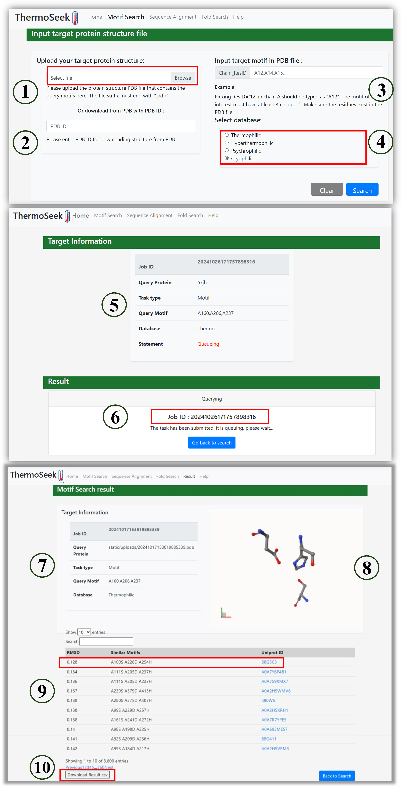
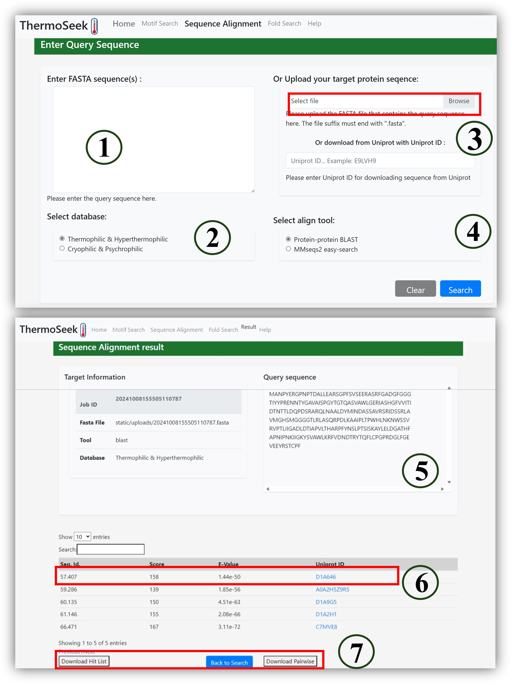
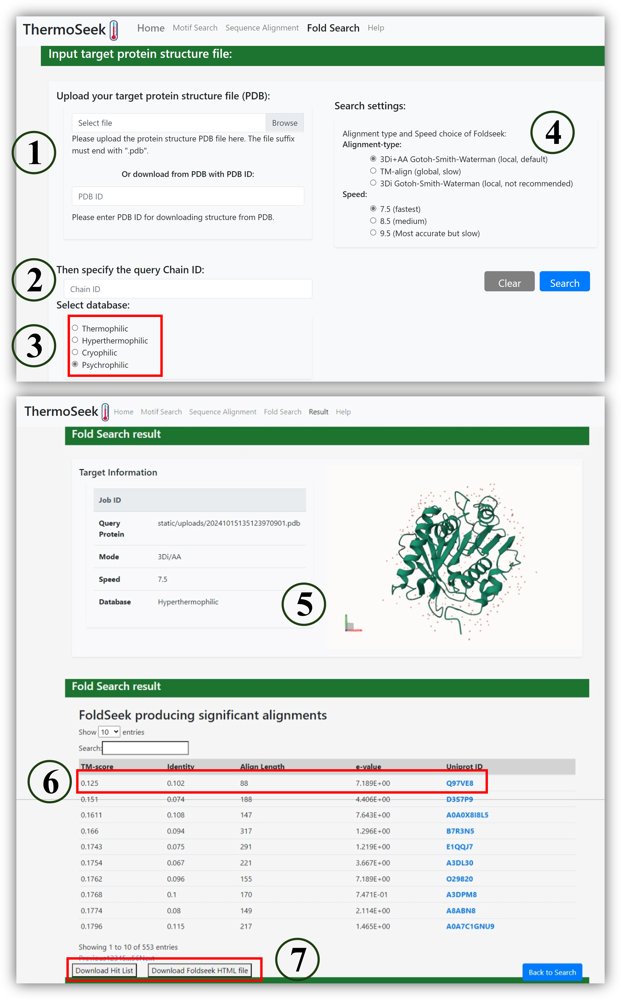

# ThermoSeek

## An Integrated Web Resource for Sequence and Structural Analysis of Proteins from Thermophilic Species

ThermoSeek is a publicly accessible web platform designed to facilitate the exploration and analysis of protein sequences and structures from thermophilic organisms. It supports sequence alignment, motif search, and structure-based fold comparison, offering a comprehensive toolkit for studying thermostable proteins.

🔗 Web Application: https://protein.org.cn/thermoseek

## 🔍 Features
Sequence Alignment
Rapid similarity search using BLAST+ and MMseqs2 against curated thermophilic protein datasets.

Motif Search
Identification of conserved sequence motifs to reveal functional and structural elements.

Fold Search
Fast and sensitive structural comparison using Foldseek to identify global fold similarity.

## 🧪 Case Study: PETase Analysis
As demonstrated in our publication, the input and output files for the Sequence and Structural Analysis of PETase example are provided in the following directories:

input/ – Contains input sequence and structure files used in the PETase case study

output/ – Contains the results generated by ThermoSeek, including alignment results, motif hits, and fold search outputs

These files serve as a practical example for users to understand how to prepare input data and interpret output results using ThermoSeek.

## 📦 Data Sources
The integrated protein sequences and predicted structures are obtained from:

NCBI Protein Database(https://www.ncbi.nlm.nih.gov/)

AlphaFold Protein Structure Database(https://alphafold.ebi.ac.uk/)

## 🛠️ Software & Tools
ThermoSeek is powered by the following open-source tools:

Fpocket v2.0 – Pocket detection in protein structures (https://github.com/Discngine/fpocket)

NCBI BLAST+ 2.13.0+ – Sequence similarity search (https://ftp.ncbi.nlm.nih.gov/blast/executables/blast+/LATEST/)

MMseqs2 – Ultra-fast sequence clustering and search (https://github.com/soedinglab/MMseqs2)

Foldseek – Structural similarity search Foldseek (https://github.com/steineggerlab/foldseek)

PyScoMotif – Motif detection in protein sequences (https://github.com/3BioCompBio/pyScoMotif)

## 🧪 Tutorial: How to Use ThermoSeek Modules
ThermoSeek provides three major modules for exploring proteins from thermophilic and cryophilic species:
Motif Search · Fold Search · Sequence Alignment

Each module supports interactive querying and downloadable results. Below are step-by-step instructions with reference to the screenshots.

##🔹 1. Motif Search
This module helps you identify similar structural motifs in thermophilic and cryophilic proteins.

## Steps:

Upload PDB file (or fetch by PDB ID) (①②)

Specify motif residues as ChainID_ResID, e.g., A160,A206,A237 (③)

Choose database: Thermophilic, Hyperthermophilic, Psychrophilic, Cryophilic (④)

Submit and get job ID (⑤⑥)

View results: motif alignments, RMSD, Uniprot IDs (⑦⑧⑨)

Click Download Result .csv to export full list (⑩)

## 🔹 2. Sequence Alignment
This module supports sequence-level homology search using BLAST or MMseqs2.

## Steps:

Paste sequence or upload FASTA file (①③)

Select database: Thermophilic & Hyperthermophilic or Cryophilic & Psychrophilic (②)

Choose alignment tool: BLAST or MMseqs2 (④)

View alignment hits with score, E-value, and Uniprot ID (⑤⑥)

Download hit list or pairwise alignment for analysis (⑦)

## 🔹 3. Fold Search
This module allows you to find structural homologs of your protein based on whole-protein fold similarity using Foldseek.

## Steps:

Upload PDB file or input PDB ID (①)

Specify chain ID and target database (②③)

Choose alignment mode (3Di+AA recommended) and speed (④)

View results: fold alignment visualization, TM-score, E-value, Uniprot ID (⑤⑥)

Download results as hit list or Foldseek HTML viewer (⑦)

## 📦 Example Case: PETase Structural and Sequence Analysis
This repository includes a complete example from our publication, illustrating the use of ThermoSeek for motif search, fold search, and sequence alignment on PETase, a plastic-degrading enzyme.

📁 Folder contents:

input/ – Contains raw input files used in the case study, including:

The original PDB structure of PETase

Associated FASTA sequence files

Manually defined motif residue specifications

output/ – Contains unprocessed raw outputs directly generated from ThermoSeek, including:

Result tables (e.g., motif search .csv, alignment hit lists)

Foldseek output files and optional HTML visualizations

BLAST/MMseqs2 alignment results

🧾 These files represent real data from the published PETase case study and are provided as-is, without post-processing.
They serve as a reference template for users to prepare input files and interpret output formats for their own protein analysis tasks using ThermoSeek.

## 📁 Downloadable Datasets
Dataset files used in the Sequence Alignment and Fold Search modules, generated with BLAST+, MMseqs2, and Foldseek, are freely available for local use:

🔗 Zenodo DOI:  http://doi.org/10.5281/zenodo.15362794

These files can be used to perform offline searches for thermophilic protein sequence and structure analysis. The scripts/ directory contains example command-line scripts to help users perform local sequence alignment and structural search using the downloaded databases.

⚠️ Note: Due to the large size of the motif database, it is currently not available for download. However, users can fully access and utilize the motif search functionality through the web application.

📬 Contact
For questions, feedback, or collaboration inquiries, please contact the development team via the ThermoSeek homepage.
