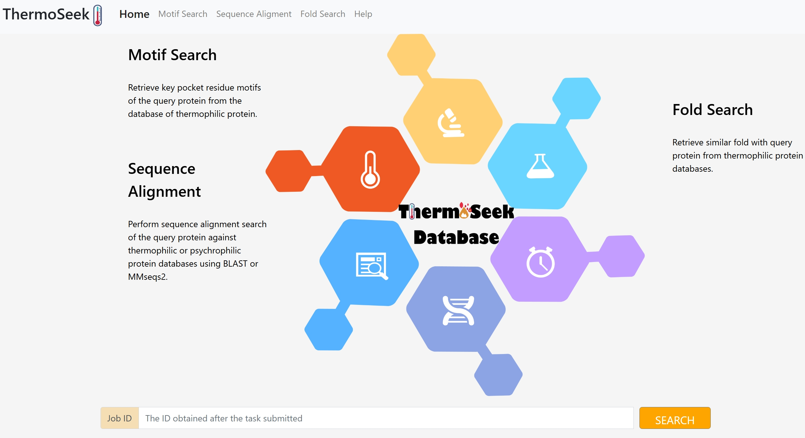

An Integrated Web Resource for Sequence and Structural Analysis of Proteins from Thermophilic Species

ThermoSeek is a publicly accessible web platform designed to facilitate the exploration and analysis of protein sequences and structures from thermophilic organisms. It supports sequence alignment, motif search, and structure-based fold comparison, offering a comprehensive toolkit for studying thermostable proteins.

🔗 Web Application: https://protein.org.cn/thermoseek

🔍 Features
Sequence Alignment
Rapid similarity search using BLAST+ and MMseqs2 against curated thermophilic protein datasets.

Motif Search
Identification of conserved sequence motifs to reveal functional and structural elements.

Fold Search
Fast and sensitive structural comparison using Foldseek to identify global fold similarity.

🧪 Case Study: PETase Analysis
As demonstrated in our publication, the input and output files for the Sequence and Structural Analysis of PETase example are provided in the following directories:

input/ – Contains input sequence and structure files used in the PETase case study

output/ – Contains the results generated by ThermoSeek, including alignment results, motif hits, and fold search outputs

These files serve as a practical example for users to understand how to prepare input data and interpret output results using ThermoSeek.

📦 Data Sources
The integrated protein sequences and predicted structures are obtained from:

NCBI Protein Database(https://www.ncbi.nlm.nih.gov/)

AlphaFold Protein Structure Database(https://alphafold.ebi.ac.uk/)

All curated datasets are accessible via the ThermoSeek web interface.

🛠️ Software & Tools
ThermoSeek is powered by the following open-source tools:

Fpocket v2.0 – Pocket detection in protein structures (https://github.com/Discngine/fpocket)

NCBI BLAST+ 2.13.0+ – Sequence similarity search (https://ftp.ncbi.nlm.nih.gov/blast/executables/blast+/LATEST/)

MMseqs2 – Ultra-fast sequence clustering and search (https://github.com/soedinglab/MMseqs2)

Foldseek – Structural similarity search Foldseek (https://github.com/steineggerlab/foldseek)

PyScoMotif – Motif detection in protein sequences (https://github.com/3BioCompBio/pyScoMotif)

📁 Downloadable Datasets
Dataset files used in the Sequence Alignment and Fold Search modules, generated with BLAST+, MMseqs2, and Foldseek, are freely available for local use:

🔗 Zenodo DOI: 10.5281/zenodo.15362795

These files can be used to perform offline searches for thermophilic protein sequence and structure analysis. The scripts/ directory contains example command-line scripts to help users perform local sequence alignment and structural search using the downloaded databases.

⚠️ Note: Due to the large size of the motif database, it is currently not available for download. However, users can fully access and utilize the motif search functionality through the web application.

📬 Contact
For questions, feedback, or collaboration inquiries, please contact the development team via the ThermoSeek homepage.
