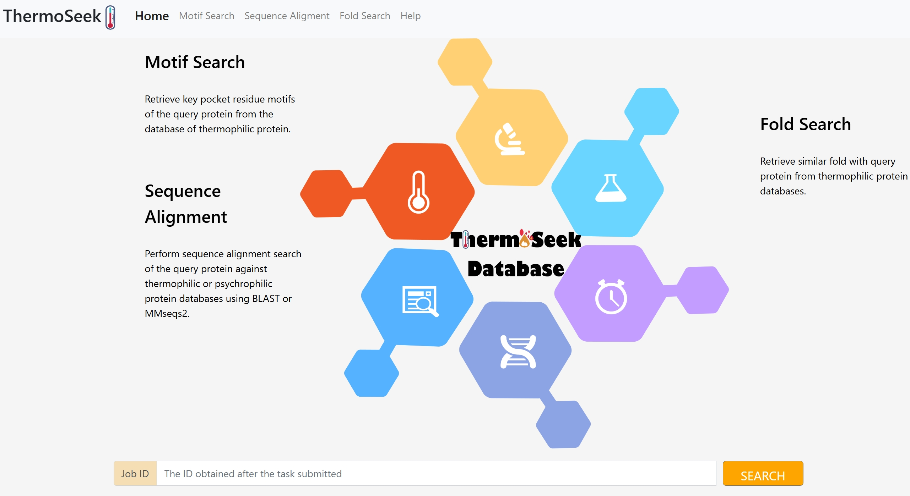

# ThermoSeek

## An Integrated Web Resource for Sequence and Structural Analysis of Proteins from Thermophilic Species

ThermoSeek is a publicly accessible web platform designed to facilitate the exploration and analysis of protein sequences and structures from thermophilic organisms. It supports sequence alignment, motif search, and structure-based fold comparison, offering a comprehensive toolkit for studying thermostable proteins.

🔗 Web Application: https://protein.org.cn/thermoseek

## 🔍 Features
- Sequence Alignment
Rapid similarity search using BLAST+ and MMseqs2 against curated thermophilic protein datasets.

- Motif Search
Identification of conserved sequence motifs to reveal functional and structural elements.

- Fold Search
Fast and sensitive structural comparison using Foldseek to identify global fold similarity.

## 🧪 Tutorial: How to Use ThermoSeek Modules
ThermoSeek provides three major modules for exploring proteins from thermophilic and cryophilic species:
Motif Search · Fold Search · Sequence Alignment

Each module supports interactive querying and downloadable results. Below are step-by-step instructions with reference to the screenshots.

#### 🔹 Motif Search [link](motif_tutorial.md)

#### 🔹 Sequence Alignment [link](seq_tutorial.md)

#### 🔹 Fold Search [link](fold_tutorial.md)

## 📦 Test Case: PETase Structural and Sequence Analysis
The input and output directories contain the input and output files of the PETase test case in our publication.

### input/ – Contains raw input files used in the case study, including:

- The original PDB structure of PETase

- Associated FASTA sequence files

- Manually defined motif residue specifications

### output/ – Contains unprocessed raw outputs directly generated from ThermoSeek, including:

- Result tables (e.g., motif search .csv, alignment hit lists)

- Foldseek output files and optional HTML visualizations

- BLAST/MMseqs2 alignment results

Please check the README.md file in the [input](input/README.md) and [output](output/README.md) directories for more details.

## 📁 Downloadable Datasets
Dataset files used in the Sequence Alignment and Fold Search modules, generated with BLAST+, MMseqs2, and Foldseek, are freely available for local use:

🔗 Zenodo DOI:  http://doi.org/10.5281/zenodo.15362794

These files can be used to perform offline searches for thermophilic protein sequence and structure analysis. The scripts/ directory contains example command-line scripts to help users perform local sequence alignment and structural search using the downloaded databases.

⚠️ Note: Due to the large size of the motif database, it is currently not available for download. However, users can fully access and utilize the motif search functionality through the web application.

