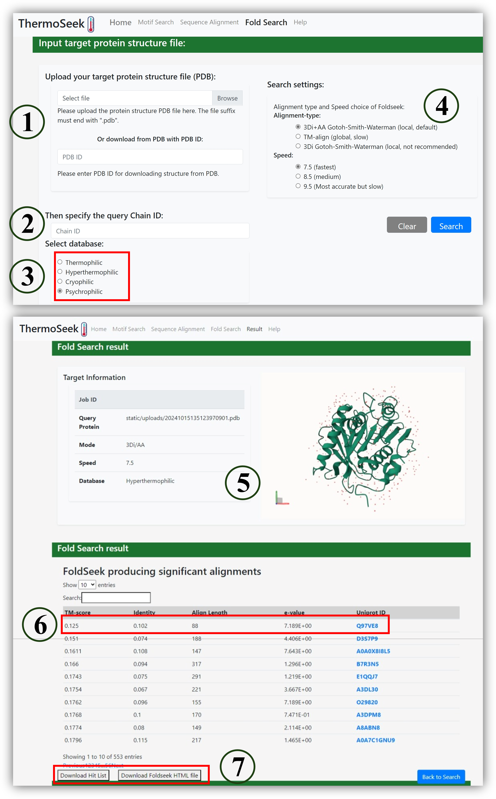

This Fold Search allows you to find structural homologs of your protein based on whole-protein fold similarity using Foldseek.

#### Steps:

1. Upload PDB file or input PDB ID (①)

2. Specify chain ID and target database (②③)

3. Choose alignment mode (3Di+AA recommended) and speed (④)

4. View results: fold alignment visualization, TM-score, E-value, Uniprot ID (⑤⑥)

5. Download results as hit list or Foldseek HTML viewer (⑦)

