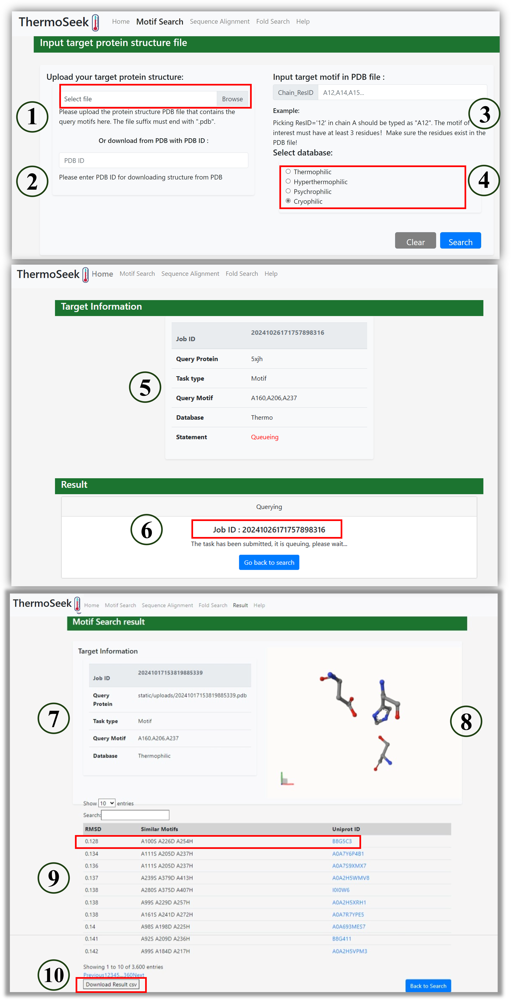

The Motif module helps you identify similar structural motifs in thermophilic and cryophilic proteins.

#### Steps:

1. Upload PDB file (or fetch by PDB ID) (①②)

2. Specify motif residues as ChainID_ResID, e.g., A160,A206,A237 (③)

3. Choose database: Thermophilic, Hyperthermophilic, Psychrophilic, Cryophilic (④)

4. Submit and get job ID (⑤⑥)

5. View results: motif alignments, RMSD, Uniprot IDs (⑦⑧⑨)

6. Click Download Result .csv to export full list (⑩)

