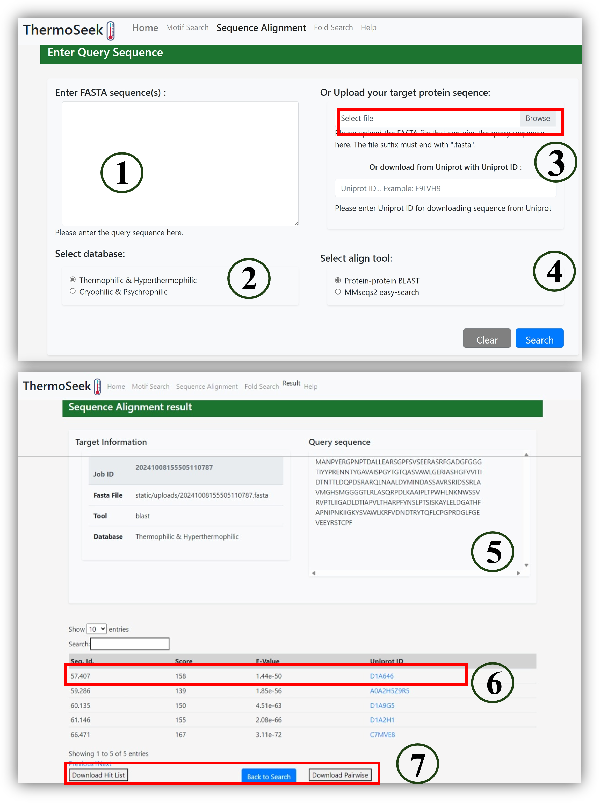

The sequence alignment module supports sequence-level homology search using BLAST or MMseqs2.

#### Steps:

1. Paste sequence or upload FASTA file (①③)

2. Select database: Thermophilic & Hyperthermophilic or Cryophilic & Psychrophilic (②)

3. Choose alignment tool: BLAST or MMseqs2 (④)

4. View alignment hits with score, E-value, and Uniprot ID (⑤⑥)

5. Download hit list or pairwise alignment for analysis (⑦)
